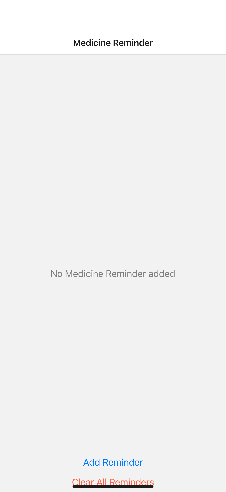
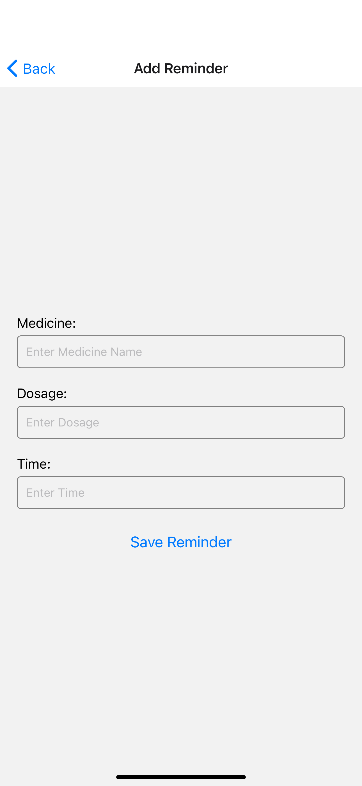
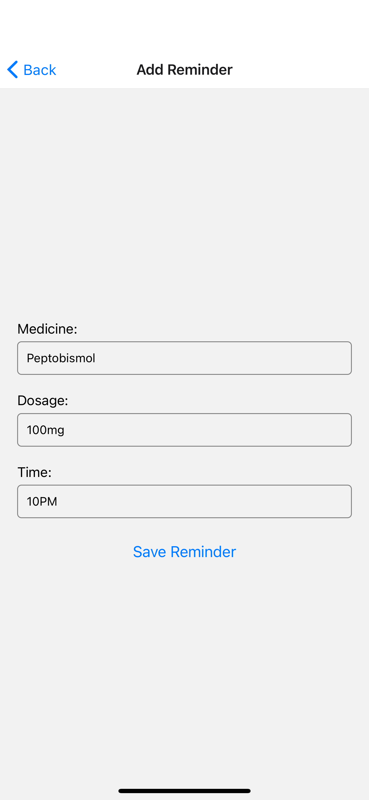
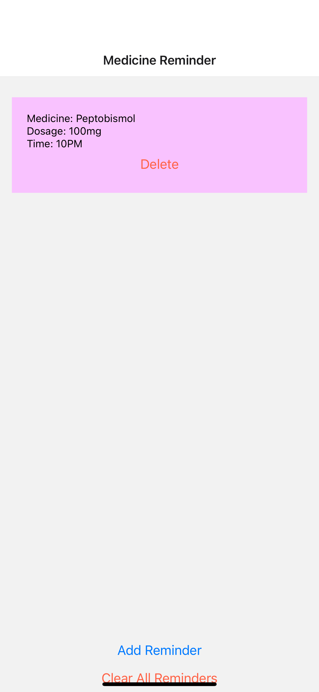
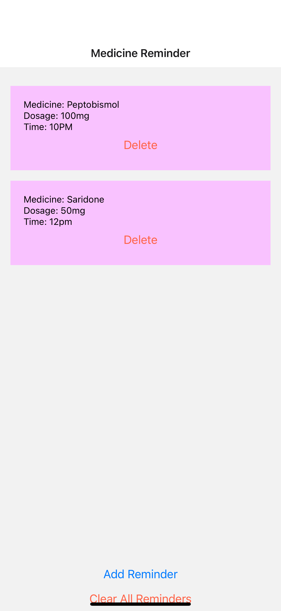
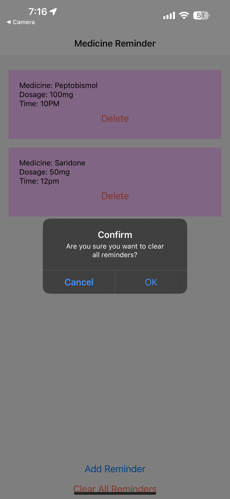

# Medicine Reminder App

Medicine Reminder App is a React Native application designed to help users manage their medication schedules. With a simple and intuitive interface, this app allows users to add, view, and delete medicine reminders.

## Features

- Add medicine reminders with name, dosage, and time.
- View a list of all medicine reminders.
- Delete individual reminders.
- Clear all reminders with confirmation prompt.

## Upcoming Features

- **Notifications/Alarms:** We are actively working on implementing a feature that will allow the app to send a notification or sound an alarm when it's time to take your medicine. This feature is complex, and we are dedicated to getting it right to ensure reliability and user satisfaction. Stay tuned for updates!

## Installation

To get started with the Medicine Reminder App, follow these steps:

1. Clone the repository to your local machine.
```bash
git clone https://github.com/srisuryahemanthbalusuuc/MedicineAppRemainder
```

2. Navigate to the project directory.
```bash
cd medicine-reminder-app
```

3. Install the required dependencies.
```bash
npm install
```

4. Start the application.
```bash
npx expo start
```

## Usage

Upon launching the app, you will be greeted with the home screen where you can view all the added medicine reminders.

To add a reminder:
- Tap on the "Add Reminder" button.
- Enter the medicine name, dosage, and time.
- Save the reminder.

To delete a reminder:
- Press the "Delete" button next to the reminder you wish to remove.

To clear all reminders:
- Press the "Clear All Reminders" button.
- Confirm your action in the prompted alert dialog.

## Screenshots








## Team Video Presentation

Link: https://drive.google.com/file/d/1sr5zJIGfLnlfg3hhn8T0-TpOY79HdcRN/view?usp=sharing
